<h2>Introduction</h2>


Đạo văn (plagiarism) là hành vi sử dụng ý tưởng, ngôn ngữ hoặc tác phẩm của người khác mà không có sự thừa nhận hoặc cho phép thích hợp, coi chúng là của mình. Điều này bao gồm việc sao chép, sử dụng lại ý tưởng, hoặc thậm chí là diễn đạt lại những ý tưởng đó mà không trích dẫn nguồn gốc. 

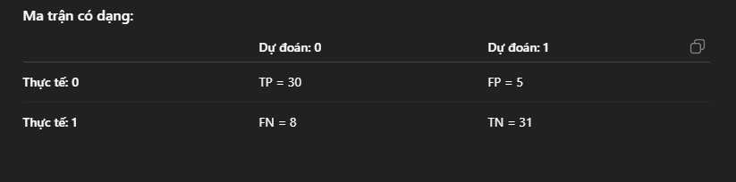


Cmd : 

venv/Scripts/activate

```

Thư viên MachineLearning:
pip install scikit-learn
pip install Flask

```
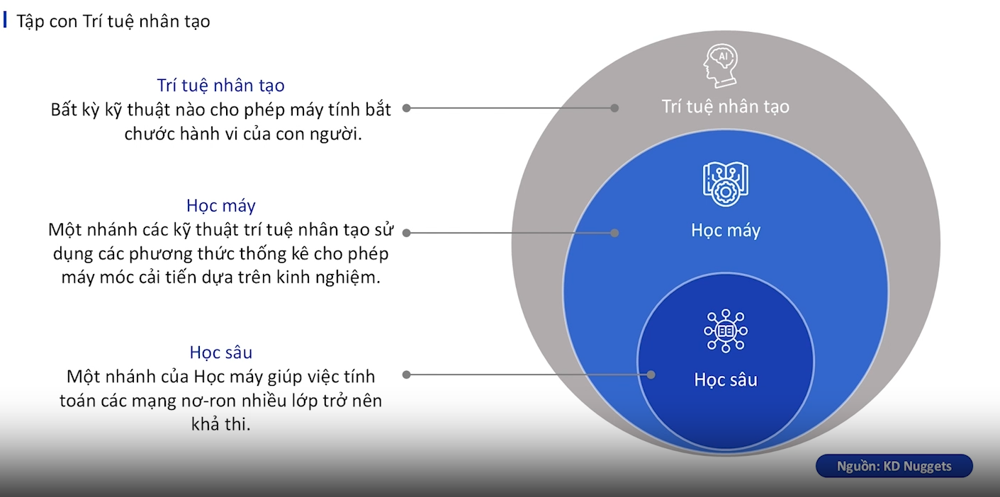
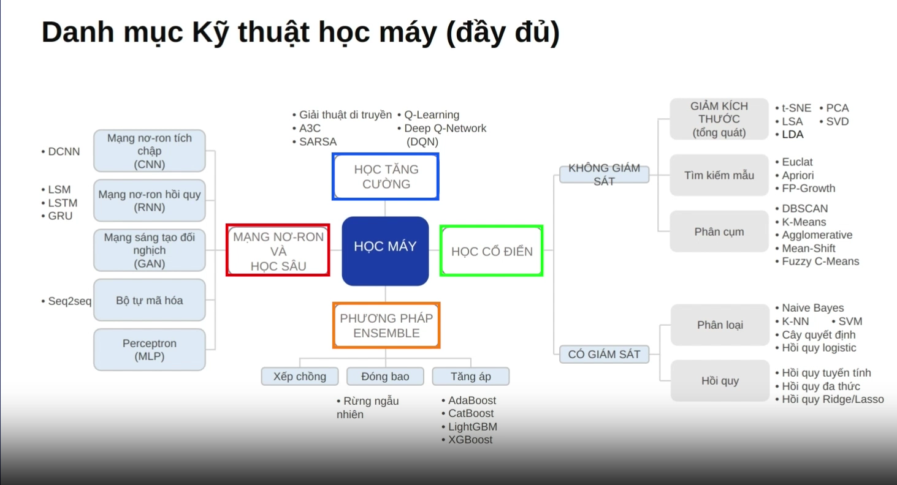

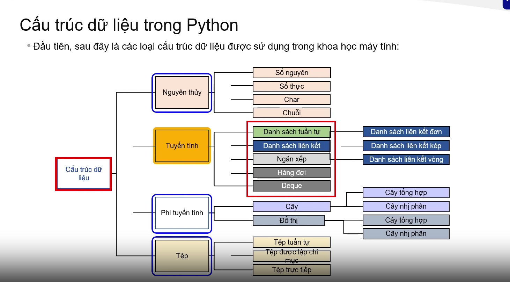

<h1>Numpy </h1>
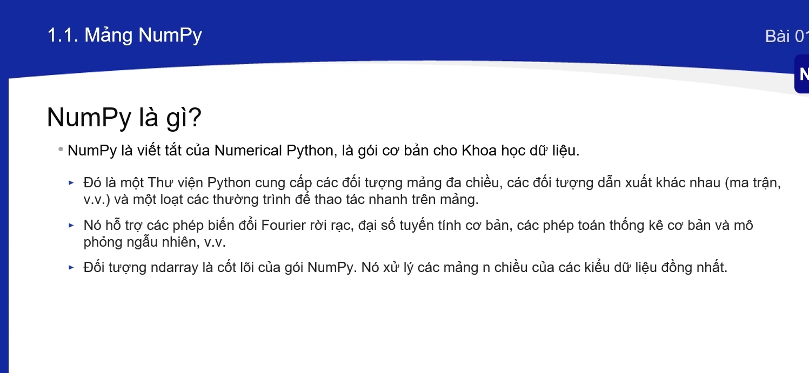

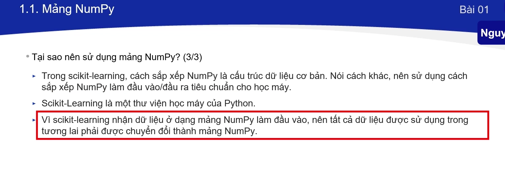

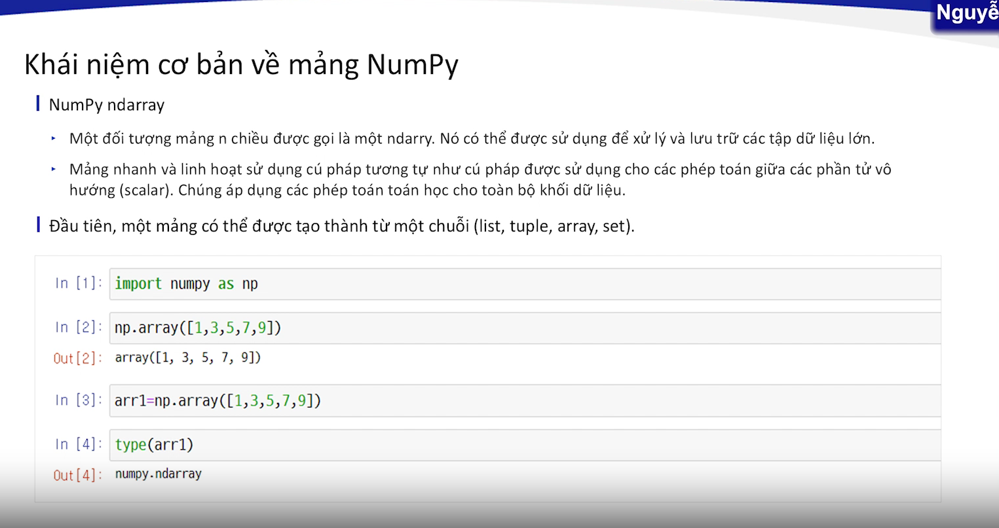

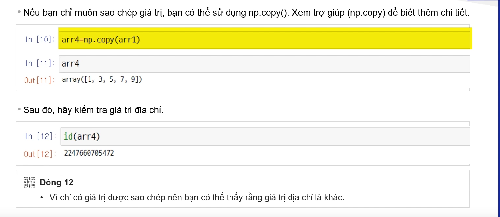

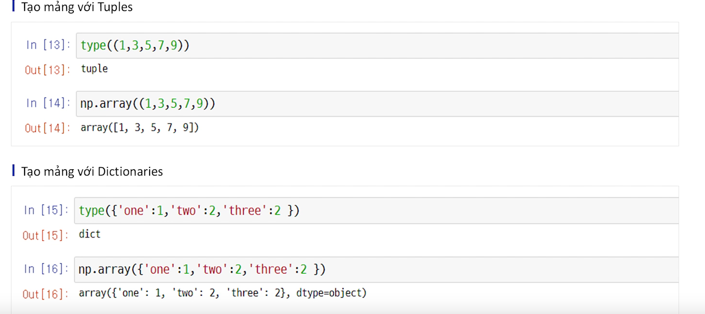

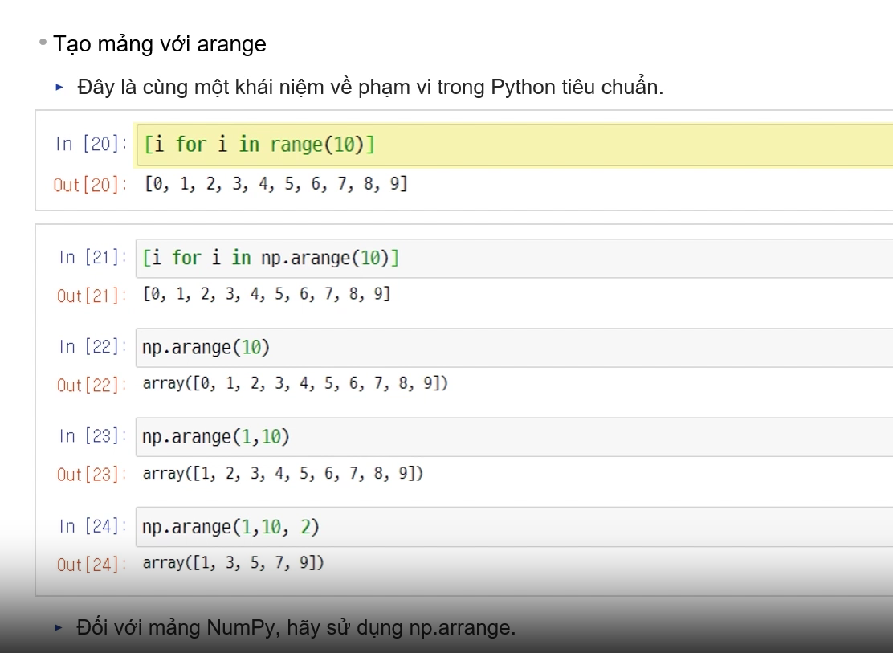

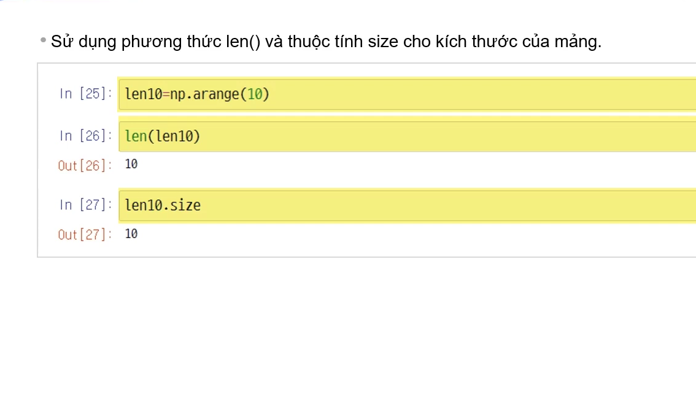

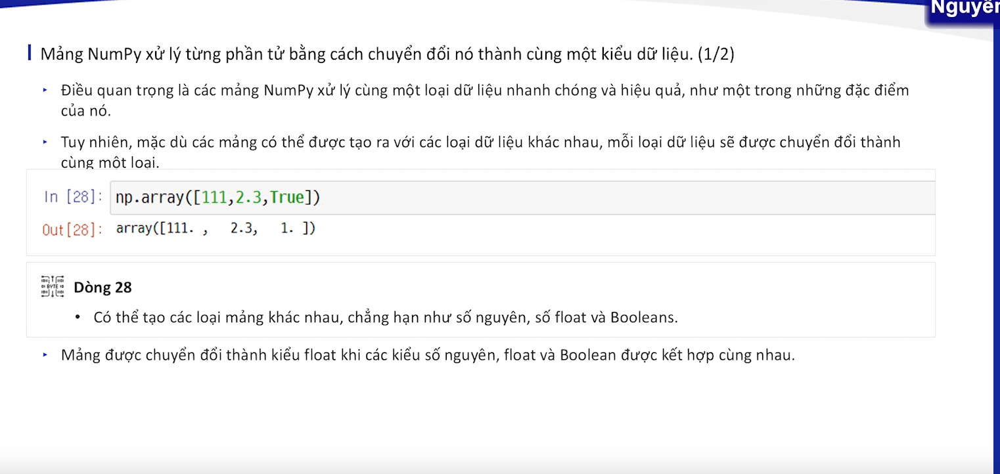

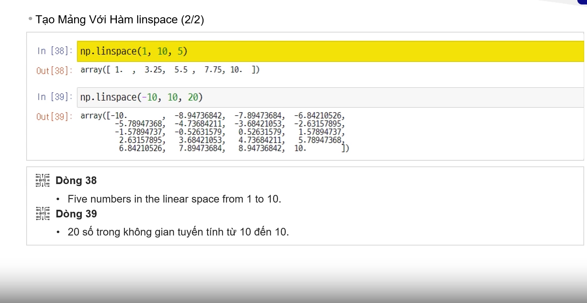


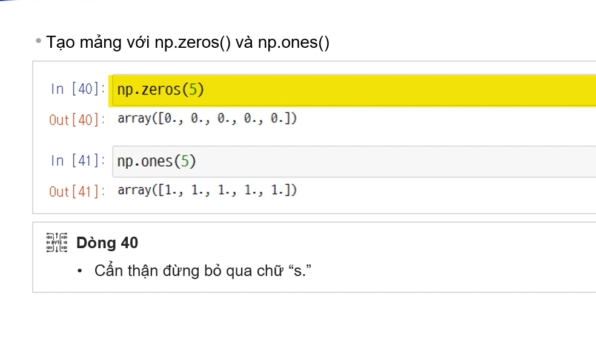


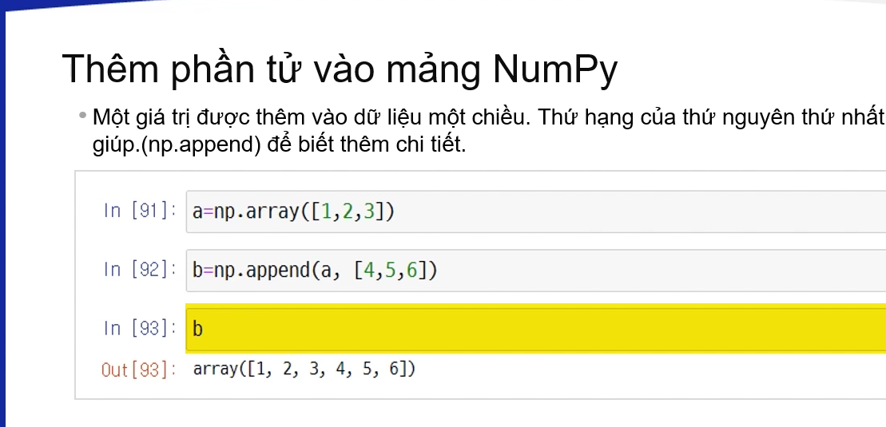


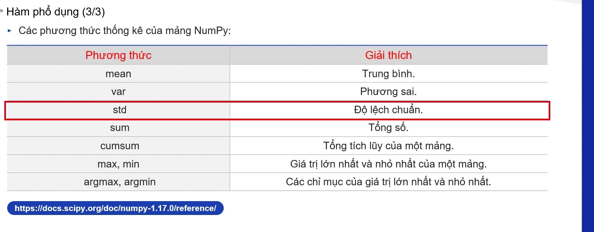

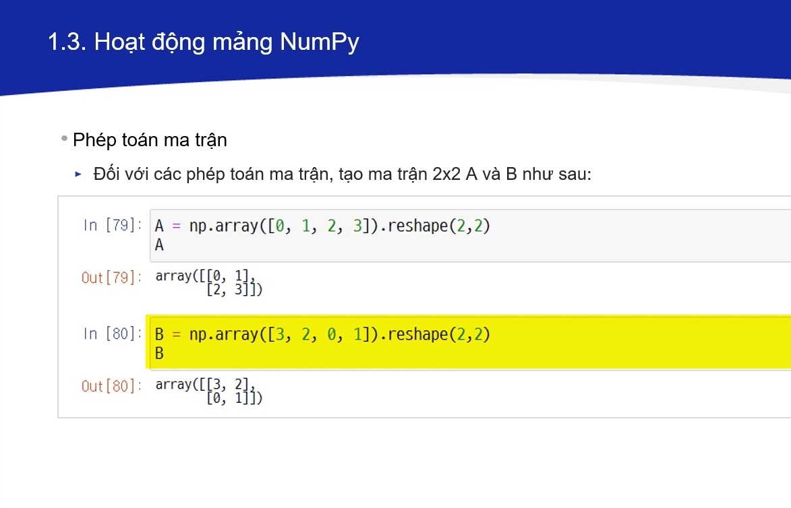

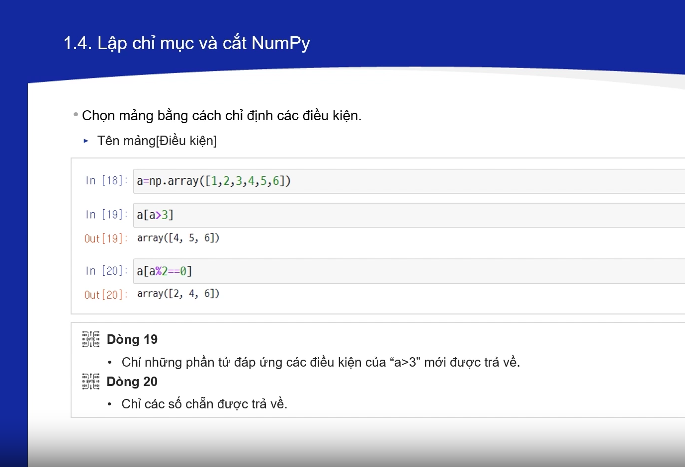


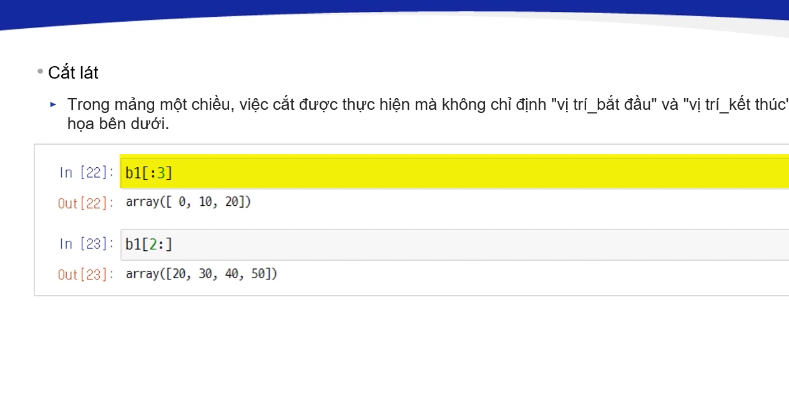

<h1>Pandas</h1>